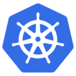

# Microservice-NextJS-MongoDB
Microservice NextJS + MongoDB Kubernetes

## Web Application 🖥️
### Create NextJS Project 
```bash
npx create-next-app@latest nextjs-app --typescript
cd nextjs-app
npm install mongoose bcryptjs
```
### Docker build Image 🐳
```bash 
docker build -t nextjs-app:0.0.1 .
```
### Load Image to KinD ♻️
```bash
kind load docker-image <image name>
```

## Deploy Web Application 
### Deploy NextJS + MongoDB 🚀
```bash
kubectl apply  -f .
```

### Forward Port Service 🪢
```bash
kubectl port-forward svc/<name svc> <port>:<port>
```

### Create Kubernetes Secret
เพื่อเก็บรหัสผ่านอย่างปลอดภัย คุณสามารถใช้ `Kubernetes` Secret

สร้าง Secret ด้วยคำสั่ง kubectl
```bash
kubectl create secret generic mongodb-secret --from-literal=password=your_password_here
```
ตรวจสอบว่า Secret ถูกสร้างขึ้นสำเร็จ
```bash
kubectl get secrets
```
Secret name `mongodb-secret` in list.

ตรวจสอบว่า Secret `mongodb-secret` ถูกสร้างและตั้งค่ารหัสผ่านอย่างถูกต้อง
```bash
kubectl get secret mongodb-secret -o yaml
```
ข้อมูลที่เข้ารหัส `Base64` ของรหัสผ่านในฟิลด์ `data.password` ตัวอย่าง:
```yaml
  data: 
    password: MHEydzNlNHI=
```

แปลง `Base64` เพื่อยืนยันรหัสผ่าน
```bash
echo "password" | base64 --decode
```

## MongoDB Setup 
### Mongo Shell
create mongodb-shell 
```bash
kubectl run -it mongodb-shell --image=mongo:4.4 --rm -- /bin/bash
```
### Connect MongoDB Shell in Pod for MongoDB StatefulSet
```bash
kubectl exec -it mongodb-0 -- bash
mongo --authenticationDatabase admin -u admin -p 1q2w3e4r
```
### Create User MongoDB Database 📖
```
use users_db
db.createCollection("users")
```
